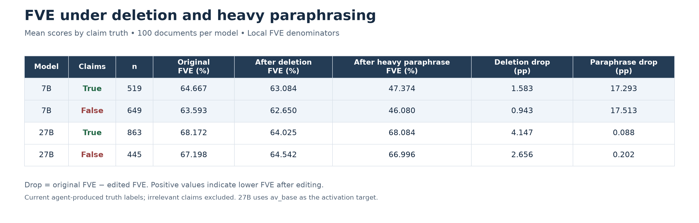
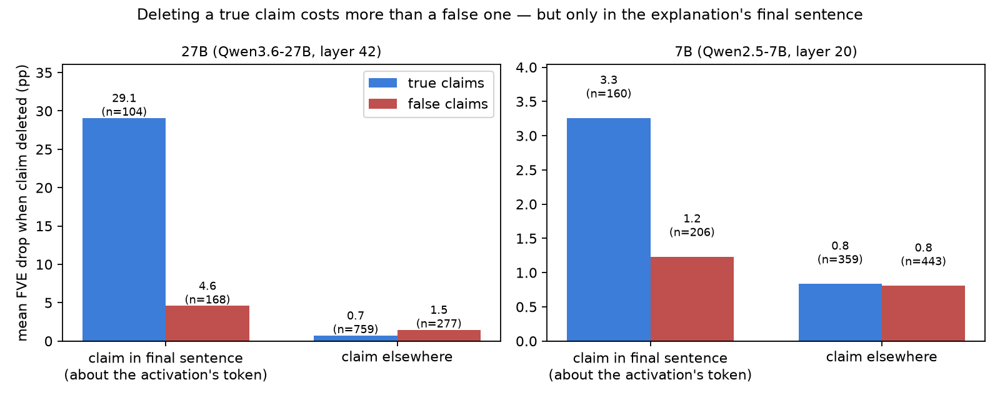

# Does deleting or paraphrasing a claim tell you if it's true?
### Testing the NLA reconstructor as a verifier on two open natural language autoencoders

**Question.** The NLA paper says its reconstructor (AR) is "a weak per-claim verifier": deleting a true claim from an
explanation hurts reconstruction more than deleting a false one. I wanted to know two things. Does that hold on two open
NLAs (Qwen2.5-7B layer 20, Qwen3.6-27B layer 42)? And does paraphrasing a claim, instead of deleting it, give a second
signal, since false claims might be contributing form (syntax, structure, relevance) while true claims carry, well, truth.

**What I found.**

1. **Deletion reproduces the paper in direction.** True claims cost more: 27B 4.15 vs 2.66 pp, 7B 1.58 vs 0.94 pp
   (paper: 0.35 vs 0.16 for detail claims). Mostly detail claims; theme claims show nothing in either model.
2. **Negative result. Paraphrase adds nothing.** 27B: 0.09 pp (true) vs 0.20 (false), and the ordering flips inside each
   claim type, so it's a mix effect. 7B: ~17 pp for both.



3. **Despite group FVE-drop mean differences for deletions, the per-claim AUROC is 0.49 (27B) and 0.58 (7B).** So
   discrimination is weak, essentially chance.
4. **The FVE gap lives at the final verbalizer sentence**, which typically describes the activation's own token. For
   those claims: 27B true 29.1 vs false 4.6 pp, 7B 3.3 vs 1.2. Everywhere else: 27B 0.7 vs 1.5, 7B 0.8 vs 0.8. The NLA
   paper doesn't report this split. Dropping the final sentence zeroes out the true vs false difference.



5. **The two NLAs behave differently.** Rewording the 7B's final-sentence claims (true or false) takes a massive ~47 pp
   of FVE, while the 27B barely moves (<1 pp) under any rewording of any one sentence, including the final one.

**Caveats.** Paraphrases are per sentence, so claims sharing a sentence share a score (1,308 claims, 571 paraphrased
sentences for the 27B). Labels are Claude's; I checked 17 blind and agreed on 14 (two I was wrong, Claude erred on one).
The 27B activations come from `av_base` (warm-start LoRA merged), not the plain model. 100 documents only. The 27B means
are outlier-heavy.

**Conclusions.** On these open NLAs the AR's deletion cost tracks truth only on average, and mainly for claims in the
final explanation sentence. Paraphrase-averaging, the thing I tested, doesn't help.

---

## Details

**Measure.** FVE (fraction of variance explained) = 1 − (squared reconstruction error) / (total variance of the
activations), so 0 means no better than guessing the mean activation. A claim's score is the FVE drop when that claim is
removed from the explanation, in percentage points.

## Setup

- **Data:** 100 Re-DocRED Wikipedia introductions (`data/redocred_pilot/`), each cut to end on a word; the
  activation is read at that last token.
- **Claims:** each explanation is split into atomic claims, labelled true / false / irrelevant against the passage
  and its Re-DocRED annotations (`fve_claims/ANNOTATION_GUIDE.md`). Labels are Claude's, spot-checked by hand.
- **Edits:** a deletion removes one claim's exact text spans (`fve_claims/gen_deletions*.py`, no LLM); a heavy
  paraphrase rewords its whole sentence, keeping every proposition (`fve_claims/REWRITE_GUIDE.md`).
- **27B deviation:** the released 27B pair ships no separate target model, so its AV base weights produce the
  activations, and the FVE denominator is computed from the 100 activations rather than a training corpus.

## Reproducing the headline

```sh
uv run python fve_claims/audit/headline_table.py      # the table above, with document-bootstrap intervals
uv run python fve_claims/audit/random_examples.py     # two random documents: explanation, claims, labels, drops
uv run python fve_claims/audit/make_spotcheck.py      # blind label check; score with score_spotcheck.py
```

## Layout

| path | what |
|---|---|
| `fve_claims/` | the experiment: claims, labels, edits, scores, analysis |
| `fve_claims/analysis_27b/` | one script per reported number (see its README) |
| `fve_claims/audit/` | verification: blind label check, re-derivations, random examples |
| `fve_claims/legacy/` | earlier sentence-level protocol, kept for provenance only |
| `overnight/` | rounds 1–5 of earlier controlled experiments on the 7B pair (side material) |
| `notes/` | protocol, comparison with the paper, review sheets, and the human log |
| `notes/human_log.md` | what the human decided, checked and found by hand |
| `src/`, `scripts/` | model loading, MPS workarounds, dataset build, smoke tests |

Agents wrote most of the code and produced the provisional claim labels; the research decisions, the audits and
the conclusions are the human's. `notes/human_log.md` records which is which.
